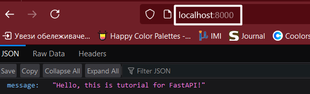
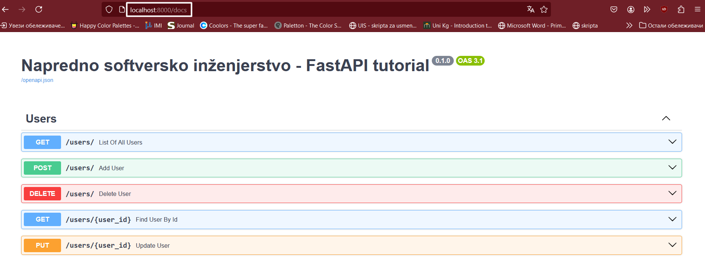
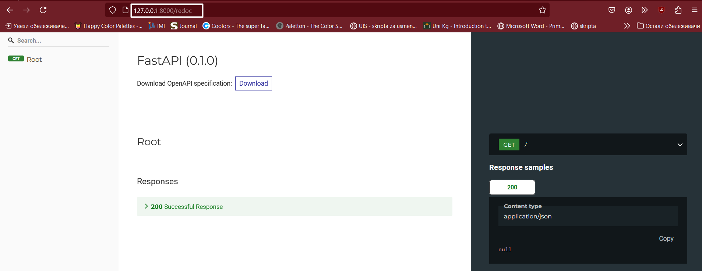

# 🌟 Python FastAPI - Tutorijal

## Problematika ##
FastAPI je Python framework kreiran sa ciljem da ubrza razvoj i unapredi kvalitet web API server-a. Sam razvoj API-ja uključuje različite izazove poput ručne validacije podataka, održavanja dokumentacije i postizanja visokih performansi naročito pri obradi velikih količina zahteva. 
FastAPI rešava ove probleme jer pruža automatsku validaciju, automatsko generisanje dokumentacije u realnom vremenu i podršku za asinhroni rad. Pored toga, FastAPI koristi Python tipove za tipsku sigurnost čime se smanjuje broj grešaka i povećava pouzdanost koda čineći sam razvoj efikasnijim i manje podložnim greškama.  

---

## 🎯 **Karakteristike FastAPI-a**

### Ključne karakteristike FastAPI-ja

1. **Automatsko dokumentovanje API-a**: FastAPI automatski generiše interaktivnu dokumentaciju API-ja koristeći OpenAPI standard. Pregled dokumentacije je dostupan na posebno definisanim krajnjim tačkama (engl. *endpoints*) u aplikaciji što olakšava razumevanje i testiranje API-ja. Ovim se štedi vreme jer nema potrebe za ručnim pisanjem opširne dokumentacije. 

2. **Python type hintovi**: Jedna od najbitnijih prednosti FastAPI-ja je upotreba Python type hintova. Parametri i povratne vrednosti funkcija se anotiraju čime se značajno poboljšava čitljivost koda. Osim toga, FastAPI automatski obavlja validaciju ulaznih podataka i generiše API dokumentaciju. 

3. **Validacija podataka**: FastAPI koristi **Pydantic** modele za automatsko proveravanje ispravnosti podataka. Pomoću Pydantic šema, mogu se jasno definisati pravila i struktura očekivanih podataka. Na ovaj način, ulazni podaci se proveravaju automatski, pretvaraju se u odgovarajuće formate i pripremaju se za dalju obradu čime je značajno smanjen rizik od rada sa neispravnim ili nepravilnim podacima. 

4. **Asinhrono programiranje**: FastAPI je ispratio trend rasta popularnosti asinhronog programiranja u Python-u, pa u potpunosti podržava asinhrone operacije. Standardno, koriste se ključne reči *async* i *await* za pisanje asinhronih krajnjih tačaka što ga čini idealnim za zadatke vezane za ulazno-izlazne operacije i poboljšava ukupno odzivnost aplikacije

5. **Dependency injection**: FastAPI podržava *dependency injection* čime je moguće definisanje i korišćenje zavisnosti među komponentama aplikacije. Upotreba *dependency injection-a* čini kod modularnim, olakšava njegovo testiranje i održavanje. 

6. **Bezbednost** : FastAPI pruža podršku za različite vrste autentifikacije i autorizacije (npr. OAuth2, JWT). Sem toga, automatskom validacijom ulaznih vrednost, FastAPI pomaže u zaštiti aplikacije od nekih uobičajenih hakerskih napada poput *SQL injection-a* ili *XSS-a (cross-site scripting)*. Ovim je značajno povećana sigurnost aplikacije i efikasno su zaštićene osetljivi podaci i korisničke informacije. 

---

## 🎯 **Prednosti i mane FastAPI-a**
### Prednosti ###
1. **Jednostavan za učenje i korišćenje**: FastAPI je dizajniran tako da bude jednostavan, naročito za Python programere. Sintaksa je intuitivna, a automatsko generisanje dokumentacije olakšava rad programera i održavanje aplikacije. 
2. **Visoke performanse**: FastAPI je jedan od najbržih web framework-a 
zahvaljujući podršci za asinhrono programiranje i efikasnim rukovanjem podacima. Aplikacije mogu
da obrađuju veliki broj zahteva pri čemu neće doći do njenog usporenja. 
3. **Automatska validacija podataka**: FastAPI automatski vrši validaciju podataka na osnovu prethodno 
definisanih struktura podataka korišćenjem Python type hintova, čime je smanjena mogućnost za nastanak 
grešaka uzrokovanih neispravnim unosom.
4. **Autentifikacija i autorizacija**: Jednostavno se upravlja autentifikacijom i autorizacijom
bez obzira da li se koristi JWT, OAuth2 ili nešto drugo. 
5. **Middleware**: Lako se dodaju middleware-i za logovanje, autentifikaciju itd. 

### Mane ###

1. **Učenje**: Iako je FastAPI prilagođen programerima, može biti izazovan za one koji se 
nisu susretali sa asinhronim programiranjem ili web framework-ovima generalno.
2. **Community zajednica i dokumentacija**: Iako community zajednica FastAPI-a
brzo raste, ona i dalje nije toliko velika kao kod nekih drugih popularnih web 
framework-a što rezultira manjkom tutorijala itd. 

---

## Zašto baš FastAPI? Ko su njegovi konkurenti? 
U odnosu na svoje konkurente poput Flask-a i Django-a, FastAPI balansira između brzog razvoja, jednostavnosti i modernih, tehničkih mogućnosti.
Flask je poznat po svojoj fleksibilnosti, ali programeri ulažu dodatno vreme na validaciji podataka, ručnom generisanju dokumentacije i obradi većeg broja zahteva.  <br> Django, kao drugi konkurent, nudi robusna rešenja, ali sa dodatnim slojevima kompleksnosti koji i nisu neophodni za razvoj API-ja. <br> Prilikom korišćenja FastAPI-ja, programeri se fokusiraju na samu logiku poslovanja, bez da gube vreme na tehničke detalje poput validacije ulaznih i izlaznih podataka ili kreiranja propratne dokumentacije. Sem toga, njegova podrška za asinhroni rad, integracija sa Python tipovima i kompatibilnost sa OpenAPI-em ga čini kao adekvatnim izborom koji objedinjuje brzinu, sigurnost i efikasnost. 

---

## :computer: **Pokretanje projekta**

## Kloniranje projekta

- **Klonirajte projekat sa Github-a**
```bash 
git clone https://github.com/jefimija-stamenovic/nsi-tutorial
```
- **Premestite se u folder fast-api**

```bash 
cd fast-api
```

### Virtuelno okruženje
Pre nego što instaliramo **Python FastAPI** web framework, kreiraćemo virtuelno okruženje (engl. *virtual environment*). Kreiranjem virtuelnog okruženja, omogućena je izolacija biblioteka u Python-u čime se sprečavaju potencijalni konflikti među verzijama i obezbeđuje se konzistentnost u radu na projektu. Upotreba virtuelnih okruženja je naročito korisna prilikom rada na više projekata gde svaki projekat zahteva neku drugu verziju iste biblioteke. U terminalu unesite sledeću komandu: 
```bash
python -m venv naziv_virtuelnog_okruzenja
```

Da bismo aktivirali kreirano virtuelno okruženje, u terminalu unosimo sledeću komandu: 
```bash
naziv_virtuelnog_okruzenja\Scripts\Activate.ps1
```

Sada kada smo aktivirali virtuelno okruženje, možemo da instaliramo sve biblioteke koje su potrebne za pokretanje projekta. U terminalu unesite sledeću komandu: 
```bash 
    pip install -r requirements.txt
```
U ovom projektu će biti korišćena MySQL baza podataka i zato je potrebno da kreirate bazu sa podešavanjima prikazanim na slici ispod:


Da bismo pokrenuli naš web server, u terminalu kucamo sledeću komandu 
```bash
   fastapi dev main.py
```

Klikom na sledeći [link](http://127.0.0.1:8000/), u okviru web pretraživača, imaćete sledeći rezultat: 



Prilikom kreiranja **Python FastAPI** projekta, na [http://127.0.0.1:8000/docs](http://127.0.0.1:8000/docs) 
je dostupan Swagger UI. Swagger UI je jedan od Swagger alata koji omogućava pregled i interakciju sa API-jima 
web servera kroz interaktivni web interfejs. Korisnici mogu da vide sve dostupne krajnje tačke (engl. *endpoints*), 
parametre i odgovore API-ja, kao i da direktno testiraju pozive bez nekih dodatnih alata. Trenutni izgled Swagger 
UI-a je prikazan na slici ispod: 



Alternativno, na [http://127.0.0.1:8000/redoc](http://127.0.0.1:8000/redoc) je dostupan ReDoc (slika ispod). 
Redoc je alat otvorenog koda (engl. *open-source*) za automatsko pravljenje API dokumentacije. ReDoc projekat je 
dostupan na Github-u, tako da možete pogledati projekat na [linku](https://github.com/Redocly/redoc)



### ⚙️ Šta je Uvicorn?
Sastavni deo FastAPI aplikacije je **Uvicorn**, brz i lagan ASGI (Asynchronous Server Gateway Interface) server koji omogućava pokretanje aplikacije i obradu korisničkih zahteva. Uvicorn obezbeđuje brzu i pre svega efikasnu komunikaciju 
klijenta i servera, pri čemu podržava i moderne tehnologije kao što su HTTP/2 i WebSocket. Integracija FastAPI-a i Uvicorn-a garantuje visoke performanse i stabilan rad aplikacije što ga čini pogodnim za produkciju. 

Alternativno pokretanje projekta korišćenjem uvicorn-a je: 
```bash
uvicorn main:app --reload
```

### Arhitektura FastAPI web servera

Na slici ispod je prikazana arhitektura FastAPI web servera: 


Arhitekturu možemo da podelimo na nekoliko segmenata: 
1. Klijent - šalje HTTP zahteve (GET, POST, PUT, DELETE) na određeni URL (http://localhost:8000/...) putem web pretraživača ili nekog drugog interfejsa kako bi komucirao sa serverom. 
2. Web server - koristi se Uvicorn - asinhroni server kompatibilan sa ASGI standardom. Ujedno, Uvicorn predstavlja posrednika između klijenta i FastAPI aplikacije tako što prihvata zahteve i prosleđuje ih aplikaciji. 
3. Sloj aplikacije - predstavlja sloj koji implementira logiju apkikacije koristeći FastAPI framework. U okviru njega ima više komponenti: 
    1) *Logika rutiranja* definiše način na koji aplikacija obrađuje pristigle HTTP zahteve. Main.py predstavlja glavni fajl u okviru kog se definišu sve funkcije koje odgovaraju na zahteve. 
    2) *Pydantic modeli* se koriste za validaciju i serijalizaciju podataka čime je obezbeđeno da aplikacija ima tačne i konzistentne ulazne i izlazne podatke. Ovim modelima se definiše struktura podataka koji su potrebni za rad aplikacije. Pydantic automatski validira podatke koje klijent šalje i generiše dobro formatirane odgovore čime se značajno obrzava razvoj i smanjuje se mogućnost za nastanak grešaka 
    3) *SQLAlchemyORM* se koristi za rad sa bazom podataka na objektno-relacijski način. ORM modelima se definiše struktura podataka koji se čuvaju u bazi podataka i omogućena je jednostavna manpulacija podacima bez direktnog pisanja SQL upita. Modeli su obično deklarisani i implementirani u fajlu *model.py*
    Pored modela, imamo i fajl *database.py* koji služi za upravljanje konekcijama sa bazom podataka. U okviru ovog fajla se konfiguriše konekcija i sesije koje omogućavaju aplikaciji da komunicira sa bazom. 

# Pydantic i Logfire
FastAPI koristi standardne Python tipove podataka (int, str, float...) za definisanje tipova u aplikaciji, pa je sam kod čitljiv i lako razumljiv. 
Zahvaljujući integraciji sa bibliotekom **Pydantic**, FastAPI pruža veoma korisne alate za jednostavnu validaciju i manipulaciju podacima. 
Tim koji je razvio Pydantic, kreirao je još jedan alat **Logfire** čija je namena monitoring aplikacija. Logfire je dizajniran tako da bude jednostavan, a ujedno i efikasan za upotrebu. Integrisan je sa mnogim popularnim bibliotekama (FastAPI, OpenAI, sam Pydantic i dr.) što omogućava njegovu upotrebu za praćenje validacija u Pydantic-u i jasnije razumevanje zašto neki unosi ne ispunjavaju uslove validacije. 
Primer jedne validacije korišćenjem Pydantic biblioteke: 

```python 
from pydantic import BaseModel, ConfigDict, EmailStr, Field, field_validator
from schemas.todo import Todo, TodoCreate
from typing import List, Optional

class UserBase(BaseModel):
    email: EmailStr
    name: str = Field(min_length=3, max_length=50)
    
    model_config = ConfigDict(from_attributes=True)

    @field_validator("name")
    def name_validator(cls, name: str): 
        if not name.isalpha(): 
            raise ValueError("Name must contain only alphabetic characters!")
        return name
```

## 🎓 **Resursi za učenje**
- [FastAPI - Zvanična dokumentacija](https://fastapi.tiangolo.com)  
- [Primeri na GitHub-u](https://github.com/tiangolo/fastapi)  
- [GeeksForGeeks](https://www.geeksforgeeks.org/fastapi-introduction/)
- [Pydantic - Zvanična dokumentacija](https://docs.pydantic.dev/latest/)
- [Microsoft Visual Studio Code](https://code.visualstudio.com/docs/python/tutorial-fastapi)

---