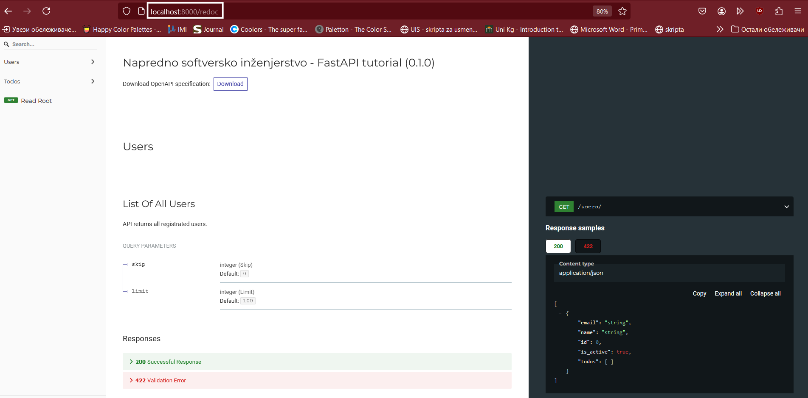

# 游 Python FastAPI - Tutorijal

FastAPI je moderan, brz (high-performance) Python web framework za kreiranje API-a. 
Dizajniran je tako da bude jednostavan za kori코캖enje, ali ujedno i efikasan i pouzdan 코to ga je u캜inilo jednim od 캜estih izbora programera za razvoj RESTful API-ja i web aplikacija. Svoju popularnost je stekao zbog jednostavnosti, automatskog generisanja dokumentacije i veoma dobrih performansi. 

---

## 游꿢 **Karakteristike FastAPI-a**

### Klju캜ne karakteristike FastAPI-ja

1. **Automatsko dokumentovanje API-a**: FastAPI automatski generi코e interaktivnu dokumentaciju API-ja koriste캖i OpenAPI standard. Pregled dokumentacije je dostupan na posebno definisanim krajnjim ta캜kama (engl. *endpoints*) u aplikaciji 코to olak코ava razumevanje i testiranje API-ja. Ovim se 코tedi vreme jer nema potrebe za ru캜nim pisanjem op코irne dokumentacije. 

2. **Python type hintovi**: Jedna od najbitnijih prednosti FastAPI-ja je upotreba Python type hintova. Parametri i povratne vrednosti funkcija se anotiraju 캜ime se zna캜ajno pobolj코ava 캜itljivost koda. Osim toga, FastAPI automatski obavlja validaciju ulaznih podataka i generi코e API dokumentaciju. 

3. **Validacija podataka**: FastAPI koristi **Pydantic** modele za automatsko proveravanje ispravnosti podataka. Pomo캖u Pydantic 코ema, mogu se jasno definisati pravila i struktura o캜ekivanih podataka. Na ovaj na캜in, ulazni podaci se proveravaju automatski, pretvaraju se u odgovaraju캖e formate i pripremaju se za dalju obradu 캜ime je zna캜ajno smanjen rizik od rada sa neispravnim ili nepravilnim podacima. 

4. **Asinhrono programiranje**: FastAPI je ispratio trend rasta popularnosti asinhronog programiranja u Python-u, pa u potpunosti podr쬬va asinhrone operacije. Standardno, koriste se klju캜ne re캜i *async* i *await* za pisanje asinhronih krajnjih ta캜aka 코to ga 캜ini idealnim za zadatke vezane za ulazno-izlazne operacije i pobolj코ava ukupno odzivnost aplikacije

5. **Dependency injection**: FastAPI podr쬬va *dependency injection* 캜ime je mogu캖e definisanje i kori코캖enje zavisnosti me캠u komponentama aplikacije. Upotreba *dependency injection-a* 캜ini kod modularnim, olak코ava njegovo testiranje i odr쬬vanje. 

6. **Bezbednost** : FastAPI pru쬬 podr코ku za razli캜ite vrste autentifikacije i autorizacije (npr. OAuth2, JWT). Sem toga, automatskom validacijom ulaznih vrednost, FastAPI poma쬰 u za코titi aplikacije od nekih uobi캜ajenih hakerskih napada poput *SQL injection-a* ili *XSS-a (cross-site scripting)*. Ovim je zna캜ajno pove캖ana sigurnost aplikacije i efikasno su za코ti캖ene osetljivi podaci i korisni캜ke informacije. 

---

## 游꿢 **Prednosti i mane FastAPI-a**
### Prednosti ###
1. **Jednostavan za u캜enje i kori코캖enje**: FastAPI je dizajniran tako da bude jednostavan, naro캜ito za Python programere. Sintaksa je intuitivna, a automatsko generisanje dokumentacije olak코ava rad programera i odr쬬vanje aplikacije. 
2. **Visoke performanse**: FastAPI je jedan od najbr쬴h web framework-a 
zahvaljuju캖i podr코ci za asinhrono programiranje i efikasnim rukovanjem podacima. Aplikacije mogu
da obra캠uju veliki broj zahteva pri 캜emu ne캖e do캖i do njenog usporenja. 
3. **Automatska validacija podataka**: FastAPI automatski vr코i validaciju podataka na osnovu prethodno 
definisanih struktura podataka kori코캖enjem Python type hintova, 캜ime je smanjena mogu캖nost za nastanak 
gre코aka uzrokovanih neispravnim unosom.
4. **Autentifikacija i autorizacija**: Jednostavno se upravlja autentifikacijom i autorizacijom
bez obzira da li se koristi JWT, OAuth2 ili ne코to drugo. 
5. **Middleware**: Lako se dodaju middleware-i za logovanje, autentifikaciju itd. 

### Mane ###

1. **U캜enje**: Iako je FastAPI prilago캠en programerima, mo쬰 biti izazovan za one koji se 
nisu susretali sa asinhronim programiranjem ili web framework-ovima generalno.
2. **Community zajednica i dokumentacija**: Iako community zajednica FastAPI-a
brzo raste, ona i dalje nije toliko velika kao kod nekih drugih popularnih web 
framework-a 코to rezultira manjkom tutorijala itd. 

---

## :computer: **Pokretanje projekta**

## Kloniranje projekta

- **Klonirajte projekat sa Github-a**
```bash 
git clone https://github.com/jefimija-stamenovic/nsi-tutorial
```
- **Premestite se u folder fast-api**

```bash 
cd fast-api
```

### Virtuelno okru쬰nje
Pre nego 코to instaliramo **Python FastAPI** web framework, kreira캖emo virtuelno okru쬰nje (engl. *virtual environment*). Kreiranjem virtuelnog okru쬰nja, omogu캖ena je izolacija biblioteka u Python-u 캜ime se spre캜avaju potencijalni konflikti me캠u verzijama i obezbe캠uje se konzistentnost u radu na projektu. Upotreba virtuelnih okru쬰nja je naro캜ito korisna prilikom rada na vi코e projekata gde svaki projekat zahteva neku drugu verziju iste biblioteke. U terminalu unesite slede캖u komandu: 
```bash
python -m venv naziv_virtuelnog_okruzenja
```

Da bismo aktivirali kreirano virtuelno okru쬰nje, u terminalu unosimo slede캖u komandu: 
```bash
naziv_virtuelnog_okruzenja\Scripts\Activate.ps1
```

Sada kada smo aktivirali virtuelno okru쬰nje, mo쬰mo da instaliramo sve biblioteke koje su potrebne za pokretanje projekta. U terminalu unesite slede캖u komandu: 
```bash 
    pip install -r requirements.txt
```
U ovom projektu 캖e biti kori코캖ena MySQL baza podataka i zato je potrebno da kreirate bazu sa pode코avanjima prikazanim na slici ispod:


Da bismo pokrenuli na코 web server, u terminalu kucamo slede캖u komandu 
```bash
   fastapi dev main.py
```

Klikom na slede캖i [link](http://127.0.0.1:8000/), u okviru web pretra쬴va캜a, ima캖ete slede캖i rezultat: 


Prilikom kreiranja **Python FastAPI** projekta, na [http://127.0.0.1:8000/docs](http://127.0.0.1:8000/docs) 
je dostupan Swagger UI. Swagger UI je jedan od Swagger alata koji omogu캖ava pregled i interakciju sa API-jima 
web servera kroz interaktivni web interfejs. Korisnici mogu da vide sve dostupne krajnje ta캜ke (engl. *endpoints*), 
parametre i odgovore API-ja, kao i da direktno testiraju pozive bez nekih dodatnih alata. Trenutni izgled Swagger 
UI-a je prikazan na slici ispod: 


Alternativno, na [http://127.0.0.1:8000/redoc](http://127.0.0.1:8000/redoc) je dostupan ReDoc (slika ispod). 
Redoc je alat otvorenog koda (engl. *open-source*) za automatsko pravljenje API dokumentacije. ReDoc projekat je 
dostupan na Github-u, tako da mo쬰te pogledati projekat na [linku](https://github.com/Redocly/redoc)



### 丘뙖잺 맚a je Uvicorn?
Sastavni deo FastAPI aplikacije je **Uvicorn**, brz i lagan ASGI (Asynchronous Server Gateway Interface) server koji omogu캖ava pokretanje aplikacije i obradu korisni캜kih zahteva. Uvicorn obezbe캠uje brzu i pre svega efikasnu komunikaciju 
klijenta i servera, pri 캜emu podr쬬va i moderne tehnologije kao 코to su HTTP/2 i WebSocket. Integracija FastAPI-a i Uvicorn-a garantuje visoke performanse i stabilan rad aplikacije 코to ga 캜ini pogodnim za produkciju. 

Alternativno pokretanje projekta kori코캖enjem uvicorn-a je: 
```bash
uvicorn main:app --reload
```

### Arhitektura FastAPI web servera

Na slici ispod je prikazana arhitektura FastAPI web servera: 


Arhitekturu mo쬰mo da podelimo na nekoliko segmenata: 
1. Klijent - 코alje HTTP zahteve (GET, POST, PUT, DELETE) na odre캠eni URL (http://localhost:8000/...) putem web pretra쬴va캜a ili nekog drugog interfejsa kako bi komucirao sa serverom. 
2. Web server - koristi se Uvicorn - asinhroni server kompatibilan sa ASGI standardom. Ujedno, Uvicorn predstavlja posrednika izme캠u klijenta i FastAPI aplikacije tako 코to prihvata zahteve i prosle캠uje ih aplikaciji. 
3. Sloj aplikacije - predstavlja sloj koji implementira logiju apkikacije koriste캖i FastAPI framework. U okviru njega ima vi코e komponenti: 
    1) Logika rutiranja defini코e na캜in na koji aplikacija obra캠uje pristigle HTTP zahteve. Main.py predstavlja glavni fajl u okviru kog se defini코u sve funkcije koje odgovaraju na zahteve. 
    2) Pydantic modeli se koriste za validaciju i serijalizaciju podataka 캜ime je obezbe캠eno da aplikacija ima ta캜ne i konzistentne ulazne i izlazne podatke. Ovim modelima se defini코e struktura podataka koji su potrebni za rad aplikacije. Pydantic automatski validira podatke koje klijent 코alje i generi코e dobro formatirane odgovore 캜ime se zna캜ajno obrzava razvoj i smanjuje se mogu캖nost za nastanak gre코aka 
    3) SQLAlchemyORM se koristi za rad sa bazom podataka na objektno-relacijski na캜in. ORM modelima se defini코e struktura podataka koji se 캜uvaju u bazi podataka i omogu캖ena je jednostavna manpulacija podacima bez direktnog pisanja SQL upita. Modeli su obi캜no deklarisani i implementirani u fajlu *model.py*
    Pored modela, imamo i fajl *database.py* koji slu쬴 za upravljanje konekcijama sa bazom podataka. U okviru ovog fajla se konfiguri코e konekcija i sesije koje omogu캖avaju aplikaciji da komunicira sa bazom. 

# Pydantic
FastAPI koristi standardne Python tipove podataka (kao 코to su int, str, float...) za definisanje tipova u aplikaciji. FastAPI ima integraciju sa bibliotekom 
Pydantic koja omogu캖ava jednostavno validiranje i manipulaciju podacima. 

## 游꿉 **Resursi za u캜enje**
- [FastAPI - Zvani캜na dokumentacija](https://fastapi.tiangolo.com)  
- [Primeri na GitHub-u](https://github.com/tiangolo/fastapi)  
- [GeeksForGeeks](https://www.geeksforgeeks.org/fastapi-introduction/)
- [Pydantic - Zvani캜na dokumentacija](https://docs.pydantic.dev/latest/)

---